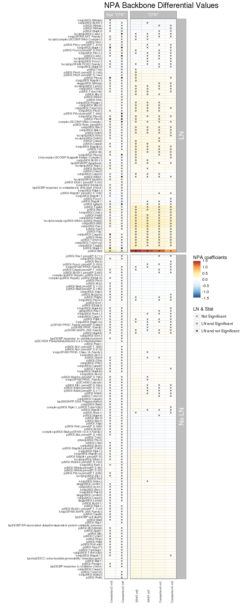
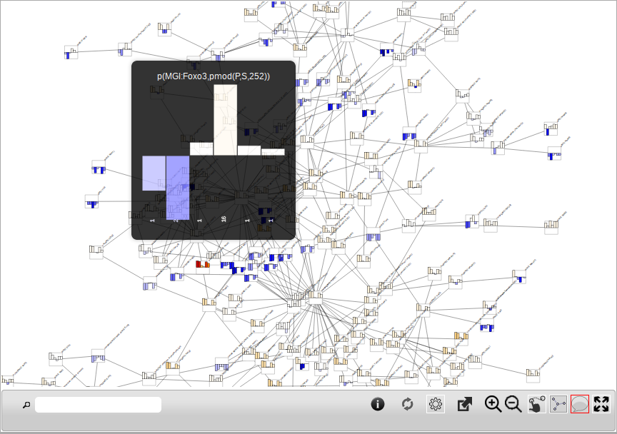
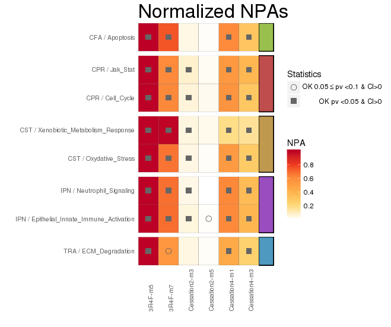
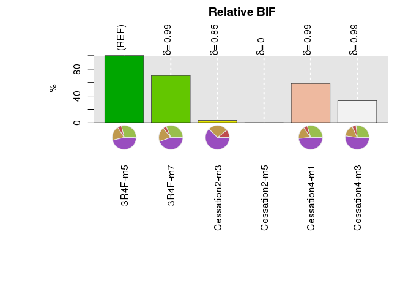
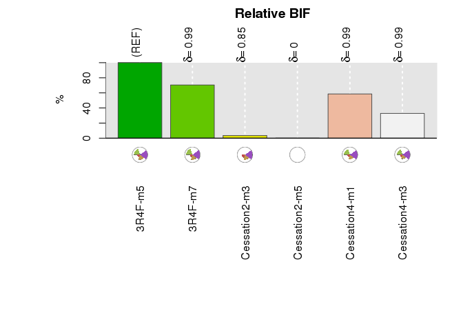
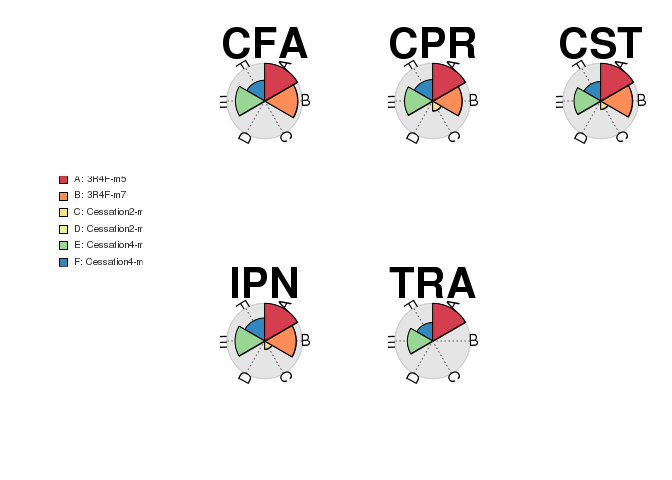
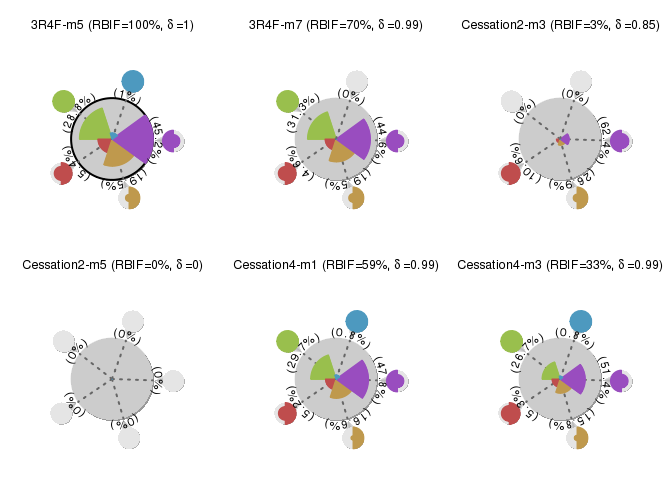

# Introduction

The NPA and BIF methods allow to understand the mechanisms behind and predict the effect of exposure based on transcriptomics datasets.
This approach enables to translate the gene expression fold-changes into differential values for each network node, and to summarize this at the network level to provide a
quantitative assessment of the degree of perturbation of the network model, the Network Perturbation Amplitude (NPA).
Combining multiple relevant network models, the overall biological impact of a perturbing agent, the Biological Impact Factor (BIF),
can be calculated by aggregating individual NPA scores.


# Network Amplitude Perturbation scoring

## Description

The network perturbation amplitude (NPA) method was previously reported (Hoeng et al., 2014, Martin et al., 2014, Hoeng et al., 2012). Briefly, the methodology aims at contextualizing transcriptome profiles (exposed vs. non-exposed) by combining the alteration of gene expression into differentiated node values (i.e. one value for each node of a causal network model (Boue et al., 2015). The network models represent the molecular mechanisms across wide range of biological processes, including cell fate, cell stress, cell proliferation, inflammation relevant for the human respiratory physiology. Relevant network models used for the analysis in this study are listed in `NPA Model object` section. For many nodes, literature-derived information supporting the relationship between a node and the expression of certain genes is available. Thus, a transcriptome profile can be used to computationally predict the activity of certain nodes. The differential node values are determined by fitting procedures inferring the values best satisfy the directionality of the causal relationships contained in the network model (e.g. positive or negative signs). NPA scores carry a confidence interval accounting for the experimental variation and the associated p-values are computed. In addition, companion statistics, derived to inform the specificity of the NPA score to the biology described in the network models, are reported as *O and K* if their p-values fall below the threshold of significance (0.05). A network is considered to be significantly impacted by exposure if the three values (the p-value for experimental variation, *O, and K* statistics) are below 0.05. The methodology has been described in a greater detail previously (Martin et al., 2014, Hoeng et al., 2012).
Finally, the key contributors to the perturbation, referred to as leading nodes, are by definition the nodes that  makes up 80% of the TopoNPA score. It both accounts for the differential backbone values themselves but also to the centrality of the nodes in the functional layer.


## Computing NPA scores from comparisons dataset and a network model

### NPA inputs

The required inputs for computing the NPA are

+ A comparisons dataset, describing a contrast (typically a treatment v.s. a control), through the gene $\log_2$ fold-changes and their associated t-statistics. Note that the whole set of genes are required as the NPA is a threshold-free approach.

+ an NPA model describing the backbone network and its functional layer, relating nodes of the backbone network to gene expression fingerprints.

#### Comparisons dataset

Comparison datasets are structured as named list.
Each entry describes as contrast from a linear model (e.g., a comparision treatment vs. control). For each entry of that list, a data.frame is expected which describes for each gene:

+ **nodeLabel**: Gene symbol as character vector
+ **foldChange**: Fold change value
+ **t**: Statistical value

The slot name in the list is set to the comparison name (e.g. `TTT1 (Dose1) vs CTRL`)

The example dataset provided with the package [E-MTAB-2756] corresponds to a study designed to
identify the onset of emphysema induced by exposure to cigarette smoke. The mice were exposed to
mainstream cigarette smoke from the Reference Cigarette 3R4F through whole body exposure for
up to 7 months. Additionaly, three cessation scenarios were included to assess the impact of
smoking cessation on the emphysema progression on C57BL/6 mice.


```{r, echo=TRUE}
library(NPA)
# Loading the comparisons example
data(COPD1)

# Showing the overall content
str(COPD1)
```


#### NPA Model object

Biological causal networks for several network families are available for the species under consideration,  _Homo sapiens_ (Hs), _Ratus norvegicus_ (Rn) and _Mus musculus_ (Mm).
Networks are classified into families that describes general biological processes such as:

+ CST: Cell Stress

+ CFA: Cell Fate

+ CPR: Cell Proliferation

+ IPN: Inflmamatory Process

+ TRA: Tissue Repair and Angiogenesis

The network models provided  in the _NPAModels_ data package are:

+ CST/Xenobiotic Metabolism: The Xenobiotic Metabolism Response network depicts the causal mechanisms involved in xenobiotic metabolism response, including the various environmental stressors and signaling components that regulate AHR and cytochrome p450 enzymes.
+ CST/Oxidative Stress: The Oxidative Stress network depicts pathways regulating cellular responses to oxidative stress, which includes intracellular free radical management, cellular responses to endogenous/exogenous oxidants and anti-oxidants and the glutathione metabolism.
+ CPR/Cell Cycle: The Cell Cycle network depicts the causal mechanisms that regulate cell cycle including canonical elements of the core machinery regulating entry and exit from the mammalian cell cycle, such as cyclins, cyclin-dependent kinases and members of the E2F family.
+ CPR/Jak-Stat: The Jak Stat network depicts the causal mechanisms involved in canonical Jak Stat signaling leading to cell proliferation and components of cell cycle machinery (e.g. cyclins, CDKN1B).
+ CFA/Apototosis: The Apoptosis network describes causal mechanisms in several different signaling pathways that are involved in the induction of apoptosis in response to environmental stimuli.
+ IPN/Epithelial_Innate_Immune_Activation: The Epithelial Innate Immune Activation network depicts causal mechanisms involved in aspects of the innate immune system that are initially activated in pulmonary epithelium in response to exposure.
+ IPN/Neutrophil_Signaling: The Neutrophil Signaling network depicts the causal mechanisms that lead to various cellular functions in neutrophils, such as polarization, extravasation, respiratory burst, response to stimuli, and chemotaxis, in response to upstream signals such as CSF3, TNF, IL8, CXCL12, F2, and FPR1.
+ TRA/ECM_Degradation: Extra-cellular matrix degradation.

In the _NPAmodels_ data packages listing and loading model can be performed by:

```{r, eval=TRUE}
library(NPAModels)

# Get the available families
list_families(species = 'Mm')

# Get the list of models available for a given family
list_models(species = 'Mm', family = 'CFA')

# Get a given network object for NPA computation
net.apopto <- load_model('Mm', 'CFA', 'Apoptosis')

print(net.apopto)
```


### NPA computation

The code chunk below describes how to compute an NPA:

```{r, eval=TRUE}
library(NPA)
library(NPAModels)
# Selecting Musculus version the Apoptosis model.
net.apopto <- load_model('Mm', 'CFA', 'Apoptosis')
data(COPD1)

npa <- compute_npa(COPD1, net.apopto, verbose = TRUE)
print(npa)
```

## Getting the list of involved comparisons

```{r, echo=TRUE}
comparisons(npa)
```

## Subsetting an NPA object

The **subset** method allows to retrieve a NPA object with a subset of comparisons:
```{r, echo=TRUE}
smaller <- subset(npa, 1:3)
print(smaller)
```

## **coefficients** method

NPA score values can be accessed with the **coefficient** method. By default, NPA scores are return
in a numeric named vector (a coefficient value per comparison). If **type** argument is set to **nodes**,
a numeric matrix is returned with NPA values per network backbone nodes and per comparison.

```{r, echo=TRUE}
coefficients(npa)
```

```{r, echo=TRUE}
coefficients(npa, type = "nodes")[10:20, 1:3]
```

## **conf.int** method

Confidence intervals of the NPA score values can be accessed with the **conf.int** method.

```{r, echo=TRUE}
conf.int(npa)
```

If **type** argument is set to value **nodes**, confidence intervals values are provided per
network nodes and comparisons.

```{r, echo=TRUE}
conf.int(npa, type = "nodes")[10:20, c(1,7)]
```

## **as.matrix** method

NPA values for nodes and comparisons can be accessed with the **as.matrix** generic.

```{r, echo=TRUE}
as.matrix(npa)[10:20, 1:3]

```

If **type** argument is set to **leadingnodes**, leading nodes ranks, signs and contribution percentage of the node
can be retrieved.

```{r, echo=TRUE}
m <- as.matrix(npa, type = "leadingnodes")
head(m)
```


## NPA summary

The **summary** method applied to an NPA returns a data.frame object with coefficients, confidence intervals and
permutations's p-values.

```{r, echo=TRUE}
summary(npa)
```


## Plotting NPA score results

### **barplot** function

The **barplot** function has been redefined for NPA class to
handle NPA objects. Different types of barplot  can be produced using the 'type'
argument:

+ type = 1: The barplot of the NPA scores with their associated statistics is produced.
+ type = 2: In addition to 'type = 1' leading nodes are added on the right side.
+ type = 3: Same barplot as 'type = 1' cerated using  _ggplot_.

The default value is 'type = 1'.

```{r, fig.width=6, fig.height=5,fig.align='center'}
barplot(npa, legend.text = TRUE)
```

Using type=2, the top 10 leading nodes are shown on the figure:

```{r, fig.width=6, fig.height=6,fig.align='center'}
barplot(npa, type = 2)
```

Finally, using type=3, a _ggplot_ version is generated:
```{r, fig.width=6, fig.height=5, fig.align='center'}
barplot(npa, type = 3)
```

### **plot** function

Two options are available for plotting an NPA object.

* type = "heatmap":Represents the network backbomne node differential values as a heatmap. Significant perturbation are displayed in a separate column panel while the leading nodes in at least one significant comparison are in a separate row panel.
* type = "graph": Displays the network as a graph where nodes scores are overlaid.

_Note: The heatmap figure can be big and may be more suitable for
PDF pages generation._

```{r eval=FALSE, fig.align='center', fig.height=22, fig.width=8, warning=FALSE}
plot(npa, type = 'heatmap')
```



The _graph_ option draws a graph figure that represents the network backbone. In each node, a barplot is displayed
showing the coefficient value for each comparison.

```{r eval=TRUE, fig.align='center'}
plot(npa, type = 'graph')
```

The _graphjs_ option generates a HTML/javascript interactive graph using the _RGraph2js_ package that can be accessed in a web browser.

```{r eval=FALSE}
plot(npa, type = 'graphjs')
```


## NPA modules

Modules are network sub-graphs that are dense in leading nodes across
all comparisons. In order to plot modules, modules should be first
retrived by calling the **modules** method on a **NPA** object.

```{r eval=TRUE, echo=TRUE}
m <- modules(npa)
```

The maximum scoring connected sub-graph found can be large, therefore,
2 types of figure can ne plotted using **plot** function. It type is set
to value "single", the global network with modules is drawn.

```{r eval=TRUE, echo=TRUE}
plot(m) # Default type is 'single'
```

For very large
sub-graph, a clustered view can be obtained with `type` argument set to **multiple**.

```{r eval=TRUE, echo=TRUE}
plot(m, type = "multiple", title=TRUE)
```


# NPAList and Biological Impact factor

## Description

The network models represent functionally distinct biological processes
characterizing the systems under consideration. To objectively evaluate the
overall biological impact relative to a reference within the experiment, the
sum of the significant network perturbations for the comparison $i$ are
normalized with respect to the corresponding sum for the reference. Hence, the
relative BIF (RBIF) for the comparison $i$ is defined as follows:

$$RBIF(i)=\frac{\sum_{Net} w_i^{Net}\cdot  NPA_{\mbox{Net}}(i)}{\sum_{Net} w_{REF}^{Net}\cdot NPA_{\mbox{Net}}(REF)}$$
where the weights account in particular for three statistics associated with
the above outlined NPA algorithm and the overlaps between networks.

The contribution of a given subset, S, of network models (e.g., cell stress
sub-networks), for a comparison i, is given as follows:

$$Contrib_{S}(i)=\frac{\sum_{Net \in S} w_i^{Net} \cdot NPA_{\mbox{Net}}(i)}{\sum_{Net} w_i^{Net}\cdot NPA_{\mbox{Net}}(i)}$$

(because Nets is a disjoint union of subsets of networks, the contributions sum to one).

The relative BIF is therefore decomposed into network components by considering
the quantities $Contrib_S (i)\cdot RBIF(i)$, which can be represented as starplots.

Finally, as RBIF is an aggregated quantity, two comparisons can have the same
relative biological effect while arising from different network models. To
identify those situations, a comparability coefficient is computed as follows:

$$\delta=\frac{\sum_{Net} w_i^{Net} w_{REF}^{Net}f_i^ {Net}\cdot Q_{Net}\cdot f_{REF}^ {Net}}{\sqrt{\sum_{Net} w_i^{Net}NPA_{\mbox{Net}}(i)}\sqrt{\sum_{Net} w_{REF}^{Net}NPA_{\mbox{Net}}(REF)}}$$

This coefficient is essentially the cos angle between i and REF for the scalar
product defined in the NPA algorithm and is shown on the top of the BIF barplot.

## NPAList Object computation

For a given species in _Homo sapiens_ (Hs), _Rattus norvegicus_ (Rn) and
_Mus musculus_ (Mm), a set of NPA scores can be computed and gathered in an
object called `NPAList` where each individual NPA scores are stored per network.

```{r, eval=FALSE}
library(NPAModels)
data(COPD1)
models <- load_models(species = 'Mm')
npalist <- compute_npa_list(COPD1, models)
```

## Subsetting a **NPAList** object

The **subset** method can be used to fetch results for a subset of models and/or a subset of comparisons:

```{r, echo=TRUE, eval=FALSE}
smaller <- subset(npalist, 1:3, 1:3)
print(smaller)
```


## NPAList plotting function

A heatmap representing all the NPA scores and their statistics can be plotted using the `NPAList` object.
The networks families are displayed in separated panels.

```{r eval=FALSE, fig.align='center', fig.height=5, fig.width=7, message=FALSE, warning=FALSE}
plot(npalist)
```


## Getting the BIF object and related results

From a NPAList object, the BIF object can be computed by calling `get_bif` method on the NPAList object.

```{r eval=FALSE}
b <- get_bif(npalist)
print(as.matrix(b))
```

```
##                     BIF      CFA        CPR       CST       IPN        TRA
## 3R4F-m5       1.0000000 4.204370 0.78881556 2.8349804 6.5945360 0.15172704
## 3R4F-m7       0.8395375 3.216414 0.47663509 2.0023535 4.5769946 0.00000000
## Cessation2-m3 0.1860579 0.000000 0.05370764 0.1359210 0.3149021 0.00000000
## Cessation2-m5 0.0000000 0.000000 0.00000000 0.0000000 0.0000000 0.00000000
## Cessation4-m1 0.7655291 2.533212 0.44109257 1.4166501 4.0816911 0.06847772
## Cessation4-m3 0.5727719 1.276496 0.25519368 0.7575376 2.4556447 0.03652695
```
Different types of results can be extracted using the BIF object and the **as.matrix** method.
For instance, type **coefficients** extract the RBIF values:

```{r eval=FALSE}
b <- get_bif(npalist)
print(as.matrix(b, type = "coefficients"))
```

```
##                     RBIF
## 3R4F-m5       100.000000
## 3R4F-m7        70.482327
## Cessation2-m3   3.461753
## Cessation2-m5   0.000000
## Cessation4-m1  58.603486
## Cessation4-m3  32.806768
```

BIF coefficients for a given network family can be accessed by:
```{r eval=FALSE}
b <- get_bif(npalist)
print(as.matrix(b, type = "rbif", family = "CFA"))
```

```
##                     BIF   Apoptosis
## 3R4F-m5       1.0000000    4.492025
## 3R4F-m7       0.8665669    3.373233
## Cessation2-m3 0.0000000    0.000000
## Cessation2-m5 0.0000000    0.000000
## Cessation4-m1 0.7808467    2.738885
## Cessation4-m3 0.5573013    1.395155
```

## Plotting BIF results using BIF object

BIF results can be displayed using the **barplot** method. The pie chart at the bottom of each bar indicates the contribution of each network family to the BIF.

```{r eval=FALSE, fig.align='center', fig.height=5, fig.width=7}
barplot(b)
```


By default, contribution are displayed as a pie chart. The contributions of each network can also be displayed as straplots by using the `type` argument.

```{r eval=FALSE, fig.align='center', fig.height=5, fig.width=7}
barplot(b, type = 2)
```


The contribution of each comparison to the BIF (per network families) can be plotted by using the plot function.

```{r eval=FALSE, fig.align='center', fig.height=5, fig.width=7}
plot(b)
```



The contribution of each scored biological network to the BIF (per comparison) can also be plotted using the BIF object with the plot function. An additional argument `type` assigned to `comparisons` provides this option (default value is `networks`).

```{r eval=FALSE, fig.align='center', fig.height=5, fig.width=7}
plot(b, type="comparisons")
```

